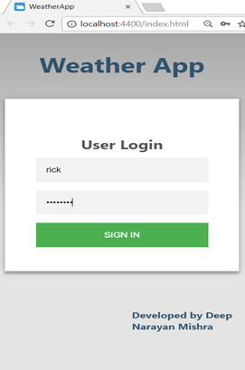

# Weather-App
#### H4 WeatherApp for Android & iOS using Cordova in JavaScript and Vue.js.
Example of Vue.js for beginners

[index.html](https://github.com/atdeepmishra/Weather-App/blob/master/WeatherApp/WeatherApp/www/index.html): File contains Vue.js templates for the App 

[index.js](https://github.com/atdeepmishra/Weather-App/blob/master/WeatherApp/WeatherApp/www/scripts/index.js): File contains interactive code for the templates

#### H4 App Screenshots

